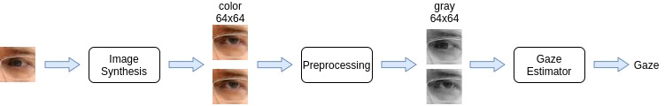

# Pipeline 2 - Eye-based Gaze Synthesis

This repository contains the implementation to run the Gaze Redirector (GR) - Gaze Estimator (GE) eye-based pipeline.

## Requirements
We implement our work in under the following requirements
- Ubuntu 18.04.5 LTS
- CUDA 10.0
- Python 3.8
- Tensorflow 1.x


Other requirements can be installed with:
```
python3 GazeML/setup.py install
```

## Eye-based pipeline



## Datasets
### Columbia Gaze

1. Download the eye-patches [Columbia Gaze dataset](https://github.com/HzDmS/gaze_redirection) to `gaze_redirection` then run
```
tar -xvf dataset.tar
```

2. Download full-face [Columbia Gaze dataset](https://www.cs.columbia.edu/CAVE/databases/columbia_gaze/) to the root folder then extract it there


### MPIIGaze
The MPIIGaze is automatically downloaded by the experiment script below.

## Training

### Within-dataset experiment
To run the augmented experiment run:
```
cd GazeML/my_src
python experiment_10.py
```
The GR and GE trained models and training logs are stored in `gaze_redirection/log_{0,1,2,3,4}` and `GazeML/outputs_exp_10_{0,1,2,3,4}` respectively.
The performance of the GR and GE on the validation set can be inspected by running Tensorboard on the log folders above.

### Cross-dataset experiment
To run the augmented experiment run:
```
cd GazeML/my_src
./experiment_3.sh
```
The GR and GE trained models and training logs are stored in `gaze_redirection/log` and `GazeML/outputs_exp_3`.
The performance of the GR and GE on the validation set can be inspected by running Tensorboard on the log folders above.

## Evaluation
Open VSCode
Launch Tensorboard in
- `GazeML/outputs_exp_3` to examine the cross-dataset performance
- `GazeML/outputs_exp_10` to examine the within-dataset performance

## Structure
- `GazeHub/` - crop eye patches from MPIIGaze full face images
- `MPIIGaze/` - contain the full-face MPIIGaze images (appear when finish step 2 in Datasets)
- `GazeML/` - gaze estimator
    - `my_src/` - scripts to run the experiments
    - `datasets/` - dataset directory
    - `outputs_exp_*` - training logs
- `gaze_redirection/` - gaze redirector
    - `dataset/` - dataset directory
    - `log/` - training log and augmented data

## References

* [Gaze Redirection Paper](https://arxiv.org/abs/1903.12530)
* [Gaze Redirection Code Repository](https://github.com/HzDmS/gaze_redirection)
* [Gaze Estimator Paper](https://arxiv.org/abs/1807.10002)
* [Gaze Estimator Code Repository](https://github.com/swook/GazeML)
* [Columbia Gaze Dataset](https://www.cs.columbia.edu/CAVE/databases/columbia_gaze/)
* [MPIIGaze Dataset](https://www.mpi-inf.mpg.de/departments/computer-vision-and-machine-learning/research/gaze-based-human-computer-interaction/appearance-based-gaze-estimation-in-the-wild)
* [Crop MPIIGaze eyes](http://phi-ai.org/GazeHub/)
